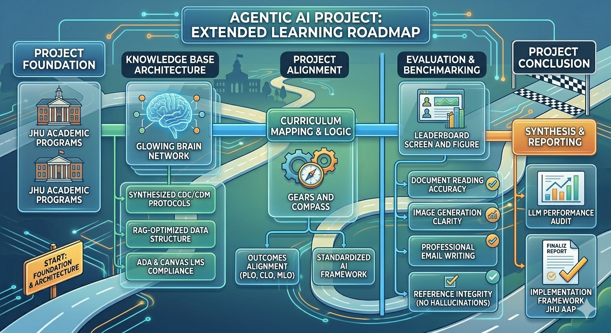

# Agentic LXD Framework
> **Bridging Pedagogical Excellence with Autonomous AI Systems**

This repository showcases a structured approach to integrating **Instructional Design (LXD)** with **Agentic AI**. Developed as part of my advanced research and professional practice.

## AI Integration Workflow: Human-in-the-Loop
```mermaid
graph TD
    A[Phase 1: Orientation] -->|Prompting| B(Students ask for Context & Analogies)
    B --> C[Phase 2: Organization]
    C -->|Validation| D(Verify AI Outlines vs Objectives)
    D --> E[Phase 3: Investigation]
    E -->|CRITICAL STEP| F{Cross-Reference Peer-Reviewed Sources}
    F --> G[Phase 4: Development]
    G -->|Synthesis| H(Digital Poster / PSA Script)
    H --> I[Phase 5: Evaluation]
    I -->|Reflection| J(Submit Prompt Log & Detect Hallucinations)
    J --> A
@'
# Agentic LXD Framework
> **Bridging Pedagogical Excellence with Autonomous AI Systems**

This repository showcases a structured approach to integrating **Instructional Design (LXD)** with **Agentic AI**. Developed as part of my advanced research and professional practice[cite: 7, 138].

## AI Integration Workflow: Human-in-the-Loop
```mermaid
graph TD
    A[Phase 1: Orientation] -->|Prompting| B(Students ask for Context & Analogies)
    B --> C[Phase 2: Organization]
    C -->|Validation| D(Verify AI Outlines vs Objectives)
    D --> E[Phase 3: Investigation]
    E -->|CRITICAL STEP| F{Cross-Reference Peer-Reviewed Sources}
    F --> G[Phase 4: Development]
    G -->|Synthesis| H(Digital Poster / PSA Script)
    H --> I[Phase 5: Evaluation]
    I -->|Reflection| J(Submit Prompt Log & Detect Hallucinations)
    J --> A
---

### 2. Kirim ke GitHub
Setelah langkah di atas selesai dan kursor kembali ke `PS C:\...>`, jalankan ini:

```powershell
git add README.md
git commit -m "Fix README layout and add visual Mermaid workflow"
git push

git add workflow.png

# 2. Update isi README agar menampilkan gambar di posisi paling atas (di bawah judul)
@'
# Agentic LXD Framework
> **Bridging Pedagogical Excellence with Autonomous AI Systems**



This repository showcases a structured approach to integrating **Instructional Design (LXD)** with **Agentic AI**. Developed as part of my advanced research and professional practice.

## Framework Structure
* **ai-logic/** : Technical simulations of RAG-based pedagogical retrieval.
* **curriculum/** : Standardized alignment samples (PLO/CLO/MLO mapping).
* **methodology/** : Theoretical foundations (Bloom’s Taxonomy, UDL).

---
**Iftinan Suwarno** | *Johns Hopkins University*
